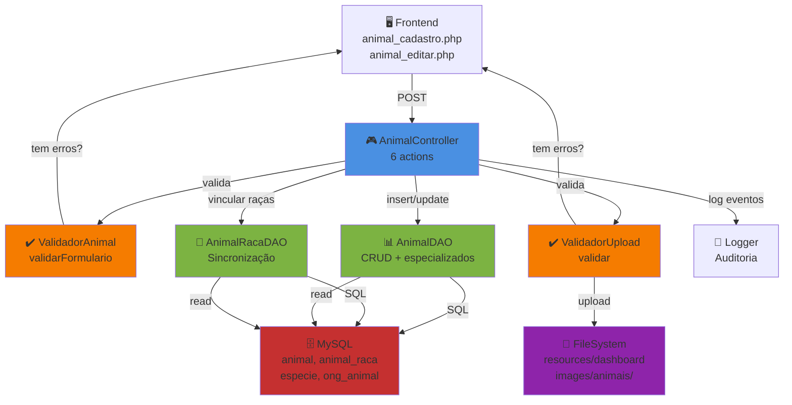
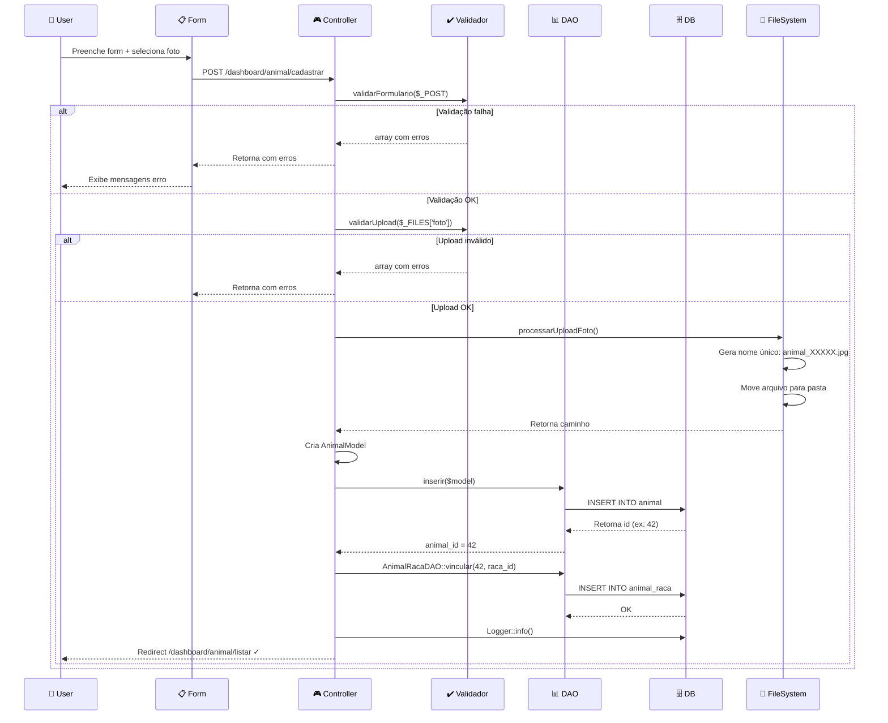
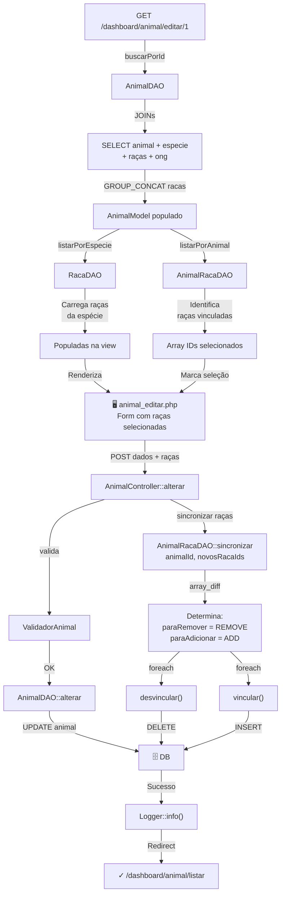
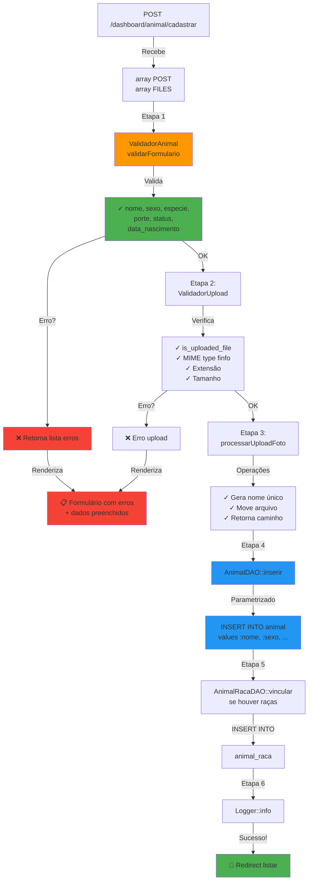
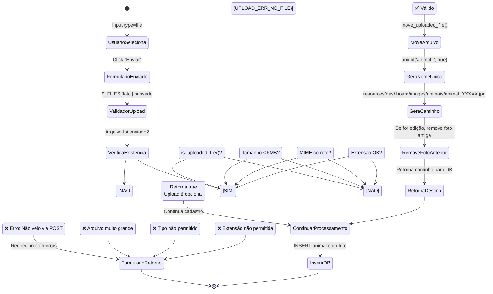
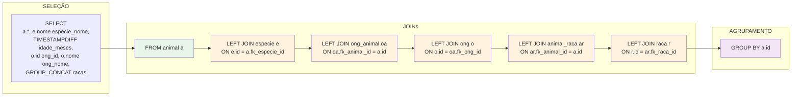
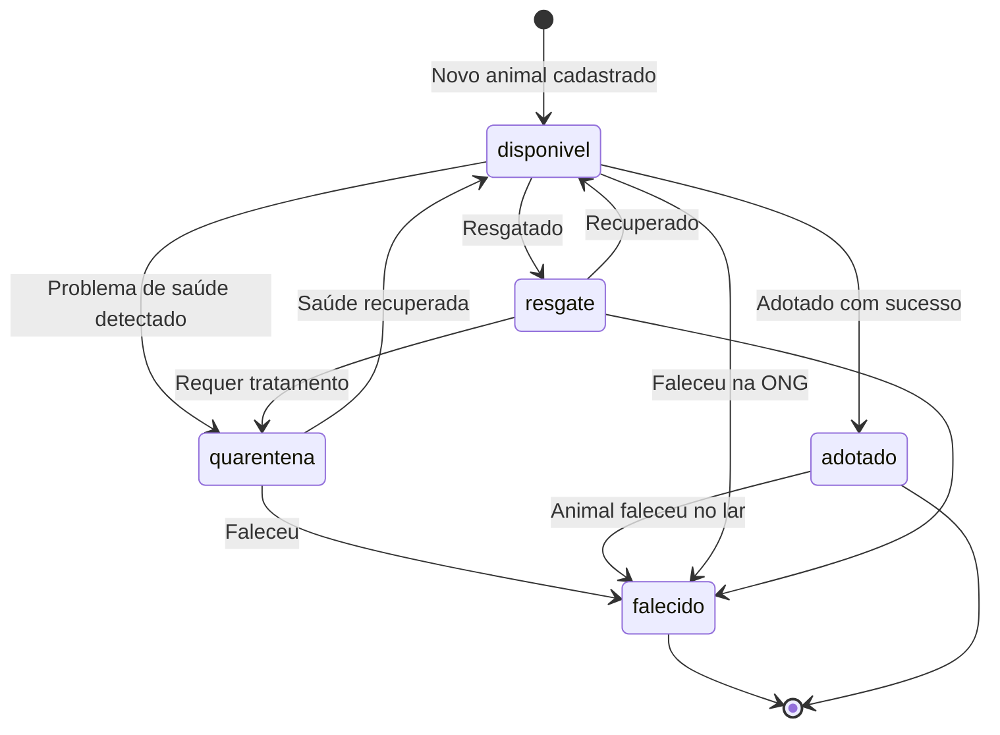

# DIAGRAMAS TÉCNICOS - MÓDULO ANIMAL

## 1. Diagrama Arquitetural



---

## 2. Fluxo Cadastro de Animal



---

## 3. Fluxo Edição + Sincronização Raças



---

## 4. Modelo de Dados - Relacionamentos

```mermaid
erDiagram
    ANIMAL ||--o{ ANIMAL_RACA : "tem"
    ANIMAL ||--o{ ONG_ANIMAL : "tem"
    ANIMAL ||--o{ SOLICITACAO_ADOCAO : "tem"
    ANIMAL ||--o{ HISTORICO_ANIMAL : "tem"

    ANIMAL }o--|| ESPECIE : "pertence"

    ANIMAL_RACA }o--|| RACA : "referencia"
    RACA }o--|| ESPECIE : "pertence"

    ONG_ANIMAL }o--|| ONG : "referencia"

    SOLICITACAO_ADOCAO }o--|| ADOTANTE : "referencia"
    HISTORICO_ANIMAL }o--|| VETERINARIO : "referencia"

    ANIMAL {
        int id PK
        string nome
        date data_nascimento
        enum sexo
        int fk_especie_id FK
        string cor
        boolean castrado
        text descricao
        enum porte
        string localizacao
        string foto
        enum status
    }

    ESPECIE {
        int id PK
        string nome
    }

    RACA {
        int id PK
        string nome
        int fk_especie_id FK
    }

    ANIMAL_RACA {
        int id PK
        int fk_animal_id FK
        int fk_raca_id FK
        unique "fk_animal_id, fk_raca_id"
    }

    ONG {
        int id PK
        string nome
    }

    ONG_ANIMAL {
        int id PK
        int fk_animal_id FK
        int fk_ong_id FK
    }
```

---

## 5. Estrutura Pastas Upload

```
resources/
└── dashboard/
    └── images/
        └── animais/
            ├── animal_65bd3c42a78c1.jpg  (2.3 MB)
            ├── animal_65bd3d50b2e4f.png  (1.8 MB)
            ├── animal_65bd3e99c1234.gif  (0.5 MB)
            └── ... (mais arquivos)

Nomenclatura: animal_{uniqid}.{extensão}
Exemplo:      animal_65bd3c42a78c1.jpg
```

---

## 6. Validação em Cascata



---

## 7. Ciclo de Vida do Upload de Foto



---

## 8. Árvore de Validação - Espécie Obrigatória

```
fk_especie_id Obrigatório?
│
├─ SIM, $_POST['fk_especie_id'] vazio
│  └─ ❌ Erro: "Espécie deve ser selecionada"
│
├─ SIM, $_POST['fk_especie_id'] = "0"
│  └─ (int) "0" = 0
│  └─ ❌ Erro: especie <= 0 é invalido
│
├─ SIM, $_POST['fk_especie_id'] = "abc"
│  └─ (int) "abc" = 0
│  └─ ❌ Erro: não é número válido
│
└─ SIM, $_POST['fk_especie_id'] = "1"
   └─ (int) "1" = 1
   └─ ✓ Número válido
   └─ ⚠️ NOTA: Banco ainda pode rejeitar se id não existe
      (FK RESTRICT no banco, mas validador não checa)
```

---

## 9. Query SELECT com JOINs Completa



---

## 10. Sincronização Raças - Array Diff

```
Raças Atuais no DB:    [2, 3, 5]
Raças Novas Enviadas:  [2, 5, 7]

         array_diff(atuais, novos)  = [3]     → REMOVER
         array_diff(novos, atuais)  = [7]     → ADICIONAR

Ações:
  DELETE FROM animal_raca WHERE fk_animal_id=42 AND fk_raca_id=3
  INSERT INTO animal_raca (fk_animal_id, fk_raca_id) VALUES (42, 7)

Resultado Final:  [2, 5, 7]  ✓
```

---

## 11. Validação de Data Futura (com BUG)

```
Input: data_nascimento = "2026-06-02"
Hoje: 2026-06-02 (10:30:00)

time() = 1654321800  (timestamp atual com hora)

strtotime("2026-06-02") = 1654252800  (começo do dia)

Comparação:
  1654252800 > 1654321800  = FALSE

Resultado: Data ACEITA ✓ (mas deveria ser rejeitada!)

PROBLEMA: strtotime retorna 00:00 do dia, time() retorna hora atual.
Se hora atual > 00:00, comparação falha.

SOLUÇÃO:
  $hoje = strtotime('today 00:00:00') = 1654252800
  strtotime($data) >= $hoje  = REJEITAR
```

---

## 12. Estado das Rotas Mapeadas vs Implementadas

```
✅ = Mapeado no banco (routes table)
❌ = Não mapeado
⚠️  = Implementado no DAO/Controller mas sem rota

AnimalController
├─ ✅ listar()
├─ ✅ cadastro()
├─ ✅ cadastrar()
├─ ✅ editar()
├─ ✅ alterar()
├─ ✅ excluir()
├─ ❌ listarDisponiveis()           (Implementado em DAO, sem ação)
└─ ❌ buscarComFiltros()            (Implementado em DAO, sem ação)

AnimalDAO - Métodos "orphaned"
├─ listarDisponiveis()              (Muito útil, não exposto)
└─ buscarComFiltros(filtros)        (10+ filtros, não exposto)
```

---

## 13. Estados Possíveis de um Animal



---

## 14. Camadas de Abstração

```
┌─────────────────────────────────┐
│   Frontend / View               │
│ (animal_cadastro.php)           │
├─────────────────────────────────┤
│   Controller Layer              │
│ AnimalController::cadastrar()   │ ← Orquestra o fluxo
├─────────────────────────────────┤
│   Validação Layer               │
│ ValidadorAnimal                 │ ← Regras de negócio
│ ValidadorUpload                 │ ← Segurança
├─────────────────────────────────┤
│   Persistência Layer            │
│ AnimalDAO::inserir()            │ ← CRUD
│ AnimalRacaDAO::vincular()       │ ← Relacionamentos
├─────────────────────────────────┤
│   Auditoria Layer               │
│ Logger::info()                  │ ← Rastreabilidade
├─────────────────────────────────┤
│   Dados Layer                   │
│ MySQL (animal, animal_raca...)  │ ← Persistência
├─────────────────────────────────┤
│   Filesystem Layer              │
│ resources/dashboard/images/     │ ← Armazenamento arquivos
└─────────────────────────────────┘
```

---

## 15. Comparação: Query vs Validador (Status ENUM)

```
┌──────────────┬──────────────────┬──────────────────────┐
│ Valor        │ Validador Aceita │ Banco Aceita          │
├──────────────┼──────────────────┼──────────────────────┤
│disponivel    │ ✓                │ ✓                    │
│adotado       │ ✓                │ ✓                    │
│resgate       │ ✓                │ ❌ (schema: removed) │
│quarentena    │ ✓                │ ❌ (schema: removed) │
│falecido      │ ✓                │ ❌ (schema: removed) │
│em_tratamento │ ❌               │ ✓ (schema: exists)   │
│reservado     │ ❌               │ ✓ (schema: exists)   │
└──────────────┴──────────────────┴──────────────────────┘

RESULTADO: Validação passa mas INSERT falha ❌
```

---

**Gerado em:** Junho 2026  
**Formato:** Diagramas Mermaid Markdown
